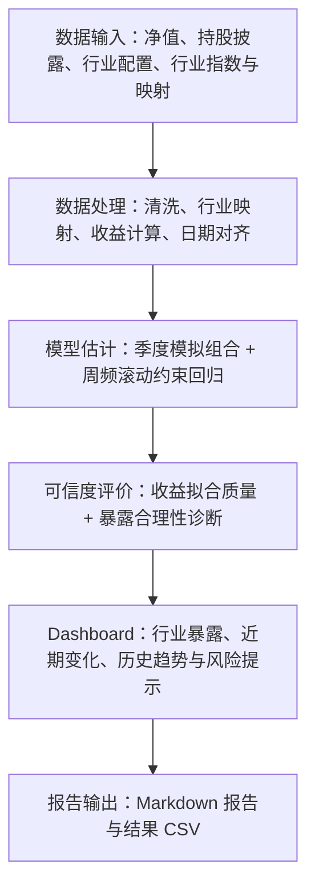

# FundTrace

**面向基金研究场景的数据智能分析产品，将低频披露与日频收益数据转化为周频行业暴露线索。**

FundTrace 通过可解释的约束模型、可信度诊断和 Dashboard，帮助研究人员发现值得进一步核查的行业配置变化。

[产品流程](#product-workflow) · [数据处理](#data-pipeline) · [模型方法](#modeling-methodology) · [产品界面](#product-interface) · [评价与局限](#evaluation-and-limitations)

> Public repository focuses on product architecture and implementation demonstration. Original research data are not included.
>
> 本仓库提供源码、方法说明和真实历史运行截图，不包含原始研究数据，也不提供在线分析服务。完整分析需要自行准备有权使用的数据。

## Overview

基金净值持续变化，持仓披露却是低频快照。在两次披露之间，研究人员难以直接观察行业配置的变化。分散的净值、持股和行业信息需要经过统一整理，才能进入持续跟踪流程。

FundTrace 将公开基金信息、净值与行业收益组织为一条分析流程：以披露构建季度模拟行业组合，再用日收益解释基金表现，形成周频隐含行业暴露。更高的输出频率来自收益数据与模型估计，并不意味着获得了新的真实持仓披露。

目标场景包括基金定期复盘、行业暴露变化观察和披露后的交叉核查。产品输出是研究线索，不是未来收益预测或自动投资决策。

## Product Workflow



用户输入基金代码，选择更新基金数据或使用已有本地数据。FastAPI 创建后台任务，调用 Python 分析入口；React 跟踪状态并展示结果。行业指数与股票行业映射底座需要预先准备，界面的“更新数据”不会自动补齐所有市场输入。

对应实现：[任务编排](api/server.py)、[分析入口](run_analysis.py)、[结果组织](api/presentation.py)、[Dashboard](frontend/src/components/ResultsDashboard.jsx)。

## Data Pipeline

### 数据输入与作用

以下文件是完整分析所需的本地输入格式，不随 Public 仓库分发。

| 数据 | 代码读取的位置 | 作用与必要性 |
|---|---|---|
| 基金基本信息 | `funds/<code>/metadata.json` 等本地元数据 | 显示基金名称与身份；不参与收益回归。缺失名称时界面使用代码兜底。 |
| 基金净值 | `funds/<code>/nav.csv` | 必需；构造基金日收益，作为模型要解释的目标。 |
| 基金持股披露 | `funds/<code>/holdings.csv` | 必需；包含股票代码、报告期和占比，用于构建季度模拟行业组合。 |
| 披露行业配置 | `funds/<code>/industry_alloc.csv` | 可选；帮助补全季度行业结构，并为暴露合计诊断提供披露参照。缺失会削弱比较能力。 |
| 行业指数日线 | `base/sw_industry_index.csv` | 必需；默认路径用申万一级行业指数收盘价计算行业日收益。 |
| 股票行业映射 | `base/stock_industry_map.csv` | 必需；将披露股票归入申万一级行业。 |
| 个股行情 | `base/stock_klines.csv` | 仅可选 `stock_level` 路径需要；默认产品流程不依赖该文件，本次历史产品验收未验证该路径。 |

默认模型的市场输入是行业指数日线，不需要独立的宏观数据库。抓取脚本还可以保存基准权重，但默认分析入口没有使用该文件，不将其列为模型依赖。

### 从原始数据到模型矩阵

1. **获取或读取数据。** [fetch_fund_manual.py](fetch_fund_manual.py) 从东方财富公开接口获取净值和分红，并通过 AkShare 获取持股及行业配置；[fetch_data.py](fetch_data.py) 提供行业指数与分类底座的获取入口。已有符合字段要求的本地 CSV 可直接由 `load_base` / `load_fund` 读取；没有独立的文件上传产品流程。外部接口可用性及数据使用许可需单独确认。
2. **清洗字段。** 统一六位股票代码、百分比和报告期；删除持股中的无效字段、非正占比及报告期内重复股票。净值抓取路径按日期排序去重，行业指数转换日期并剔除缺失日期或收盘价的记录。实现见 [simulate.py](lib/simulate.py) 与抓取脚本。
3. **构建季度模拟行业组合。** 将持股映射到行业，结合行业配置与历史结构补全未披露部分。分类转换和非重仓部分依赖假设；模拟组合不是完整持仓真值。
4. **计算基金收益。** 优先使用 `nav_adj` 复权净值，其抓取流程尝试把分红加回日收益后累乘；其次使用 `nav_unit`。代码仍保留 `nav_cum` 的警告兜底，不能将累计净值收益视为可靠的复权收益替代。分红获取失败时，复权构建会退化为单位净值收益。
5. **构造行业收益。** 将行业指数长表透视为“日期 × 行业”的收盘价矩阵，再计算日涨跌幅。基金与行业收益取共同日期；保留有效记录超过一半的行业列，其余缺失值填零。这是现有实现的缺失处理规则，可能影响估计。
6. **匹配披露时点。** 默认回归先将季度模拟组合日期后移 45 个周一至周五工作日，读取先验时再加 30 个自然日。该近似规则没有使用实际公告日期或完整交易日历，不能据此宣称严格消除了前视偏差。

最终输入为基金日收益向量 `y`、同行业日收益矩阵 `X`，以及用于约束的滞后季度模拟组合。收益计算与对齐逻辑见 [regress.py](lib/regress.py)。

## Modeling Methodology

**基金日收益 ≈ 行业日收益的加权组合 + 截距 + 未解释部分。**

模型寻找一组行业系数，使行业收益组合尽量解释最近一段时间的基金收益。这些系数表示收益口径的隐含行业暴露，不是逐笔交易或真实持仓的读取结果。

| 方法与默认参数 | 为什么需要 | 需要注意 |
|---|---|---|
| Rolling window：`window=120` | 每次使用最近最多 120 个交易日，允许估计随近期表现变化。 | 短窗口响应更快但噪声更大；窗口至少需要 60 个有效观测，早期不一定满 120 日。 |
| Exponential decay：指数时间衰减 | 较新的样本获得更高权重，减少很久以前的表现对当前估计的影响。 | 对近期变化更敏感，也可能放大短期噪声。 |
| Half-life：`half_life=40` | 40 个交易日前的样本权重约为最新样本的一半，80 日前约为四分之一；权重为 `0.5^(age / 40)`。 | 半衰期控制信息“变旧”的速度；不是预测期限。参数小于等于 0 时使用等权。 |
| Non-negative Lasso：`alpha=1e-6` | 限制行业系数非负，适配多头权益解释；L1 惩罚压缩不必要的系数。 | 不能消除相关行业之间的替代，也不适用于所有对冲策略。 |
| 总暴露上限：`equity_cap="auto"` | 限制系数合计，避免出现难以解释的总暴露。 | 当前上限为滞后模拟组合合计的 1.05 倍、最高 0.98；无可用先验时为 0.95。 |
| 周频输出：`freq="W-FRI"` | 按周组织结果，便于观察趋势与近期变化。 | 周五是结果标签；实际输入可能只更新到当周更早日期。 |

默认 `anchor_mult=None`，不启用逐行业锚定上限；季度模拟组合仍参与总暴露上限计算。求解器由 NumPy 实现，使用带约束投影的 FISTA。可选参数标定产生候选结果，不自动替换正式分析参数。

参数来源：[run_analysis.py 的命令行默认值](run_analysis.py)、[rolling_positions](lib/regress.py)、[exp_decay_weights 与求解器](lib/solver.py)。FastAPI 默认调用分析入口而不覆写这些参数。更完整的方法与取舍见 [methodology.md](docs/methodology.md)。

## Product Interface

Dashboard 展示当前行业暴露、近四周变化、过去一年趋势、披露基座对比、模型状态和下载入口。以下图片来自 **161005 的真实历史运行**，周频标签截至 **2026-08-07**，行业指数输入截至 **2026-08-05**，不代表当前市场数据。

**诊断示例：模型质量 A，结果可信度 C。**


<details>
<summary>查看完整 Dashboard：行业暴露、近期变化、趋势及诊断</summary>


</details>

<details>
<summary>查看历史行业暴露结果曲线</summary>


</details>

分析入口生成 `weekly_positions.csv`、`diagnostics.csv`、`sim_portfolio.csv`、`report.md` 和结果图 `positions.png`。当前界面下载接口提供报告、周频结果和诊断 CSV；Public 仓库仅保留展示图片，不附这些研究结果数据。

界面与源码运行方式见 [本地运行说明](docs/demo.md)。没有研究输入时可构建界面、浏览实现及运行不依赖研究数据的测试，不能 clone 后立即重算 161005。

## Evaluation and Limitations

**模型质量回答“收益解释得怎么样”；结果可信度回答“这组暴露是否值得参考”。**

- **模型质量**参考最新窗口的 R²、求解收敛情况及历史报告等级。示例 R² 约为 0.831，反映窗口内收益拟合程度，不是持仓准确率。
- **结果可信度**在基础等级上结合暴露合计差、行业结构偏离、近期变化与噪声等规则提示风险或限制等级，不改动模型系数。缺少参照数据时，会显示对应诊断不可用。规则实现见 [credibility.py](api/credibility.py)。
- 示例即使拟合质量为 A，仍因明显偏离显示可信度 C。结构参照包含模拟组合，不能当作独立确认的完整持仓真值；等级也不是统计概率。

当前边界：

- **不是实际持仓重建，也不是实时持仓查询。** 行业相关性、遗漏资产与基金个股选择都可能影响暴露解释。
- **不是未来收益预测，也不是投资建议。** 产品帮助发现需要进一步研究的变化，不替代专业研究判断。
- 数据清洗、静态行业映射、缺失填零及近似披露时点均会引入误差；`FULL` 模式的持股数量判断也不能证明数据完整。
- 1.5σ 变化带是启发式提示，不是经过覆盖率验证的统计置信区间。旧下载报告的等级与 V1.4 Dashboard 可信度可能不同，应结合诊断阅读。
- 单基金的流程验收不等于多基金泛化能力；完整持仓真值、严格样本外效果、用户研究效率与业务增益仍需验证。

既有无研究数据版本验收记录：Python **66 passed、5 skipped**；前端 **25 passed、1 skipped**，构建成功。跳过项不计作通过，合成样本测试不证明真实市场准确性。本轮为文档整理，未重跑模型。详细记录见 [validation.md](docs/validation.md)。

## Technology Stack

| 技术 | 职责 |
|---|---|
| Python | 数据获取、分析编排、报告输出与测试 |
| FastAPI | 本地分析任务、结果接口、文件下载与静态页面服务 |
| React + Recharts | 用户交互、任务状态与结果图表 |
| Pandas | 表格清洗、日期对齐、收益计算与文件读写 |
| NumPy | 特征矩阵、约束优化与数值计算 |

## Project Structure

```text
api/                    FastAPI 后端、结果组织与可信度评价
frontend/               React 界面与前端测试
lib/                    季度模拟组合、回归、求解器与标定逻辑
tools/                  启动、环境检查与回归验证工具
tests/                  Python 测试与合成样本工具
docs/                   架构、方法、运行及验证文档
assets/                 真实截图、结果图与流程说明图
run_analysis.py         完整分析入口
fetch_data.py           数据底座获取
fetch_fund_manual.py    单基金数据获取
```

架构说明见 [architecture.md](docs/architecture.md)。源码沿用 [原开发仓库](https://github.com/Aequanimis/Fundtrace) 的 V1.4 产品实现；研究数据不随本仓库分发，公开范围见 [PUBLIC_SCOPE.md](PUBLIC_SCOPE.md)。
