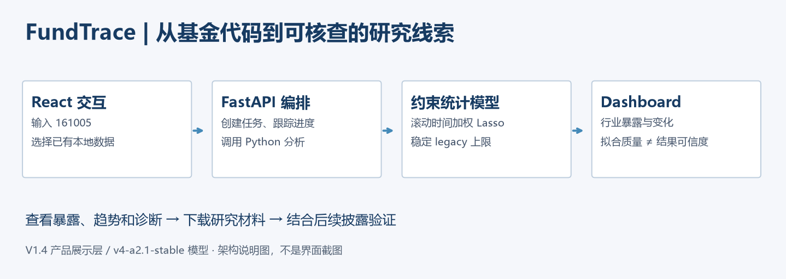
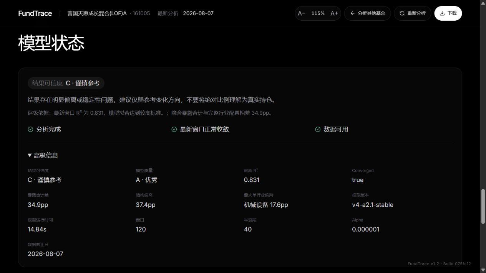
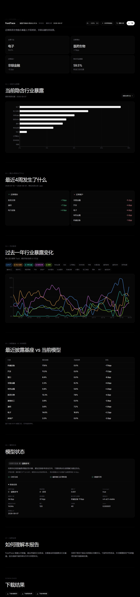
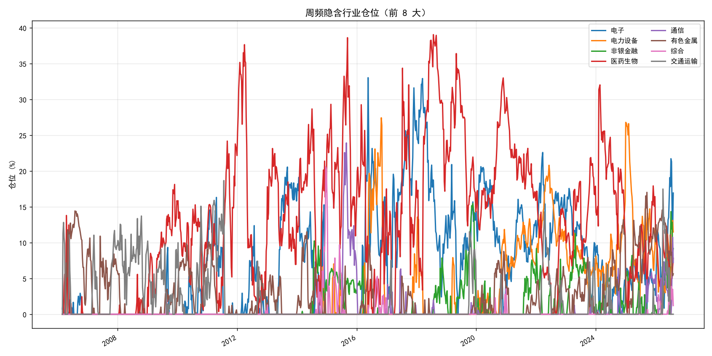

# FundTrace

**Explainable weekly fund industry exposure analytics product.**

面向基金研究场景的数据智能分析产品：将低频披露与日频净值、行业收益组织成周频暴露线索，帮助研究员决定下一步核查什么。

**Data Product + Explainable Quantitative Intelligence** · React · FastAPI · Python

> Public repository focuses on product architecture and implementation demonstration. Original research data are not included.
>
> 本仓库是独立的面试作品展示版本。保留产品源码、方法和真实运行截图，不附基金缓存、行情数据库或原开发历史。截图来自 V1.4 的本地历史数据验收，不是在线服务或合成结果。

[产品架构](docs/architecture.md) · [模型与评价](docs/methodology.md) · [演示指南](docs/demo.md) · [面试讲稿](docs/interview.md)

## Why

**业务问题：持仓披露是低频快照，基金研究却需要持续观察。**

研究员在两次披露之间难以直接看到行业配置变化。人工整理披露、分类与净值曲线可以提供信息，但不容易形成重复使用的跟踪流程。

FundTrace 将问题定义为：**有哪些行业暴露变化值得进一步验证？** 产品目标是补充研究线索，而非声称掌握实时真实持仓。

目标用户：基金研究员、基金筛选与组合研究人员。典型场景：定期复盘一只主动权益基金，识别行业偏离，并结合后续披露复核。

## Product

基金输入 → 数据处理 → 模型计算 → 行业暴露曲线 → 可信度诊断 → Dashboard 展示 → 报告输出。



| 用户任务 | 产品设计 |
|---|---|
| 开始一次研究 | 输入基金代码，选择更新数据或使用本地数据 |
| 理解发生了什么 | 当前暴露、近四周变化、历史趋势及披露基座对比 |
| 判断结果能否参考 | 将模型拟合质量与结果可信度分开展示 |
| 带入研究工作 | 下载报告、周频结果和诊断 CSV |

实习项目中主导的产品设计重点，是将数据准备、可解释估计和结果核查组织成一条可使用的流程。个人角色按项目负责人陈述；不据此宣称独立完成所有代码或已经机构上线。

## Architecture

| 层级 | 实现与职责 |
|---|---|
| Frontend | React + Recharts：输入、进度、图表、诊断与下载 |
| Backend | FastAPI，源码目录 `api/`：本地任务、结果组织和文件接口 |
| Data Pipeline | Python + Pandas：净值收益、字段清洗、行业映射与时间对齐 |
| Model Layer | NumPy：季度模拟组合、滚动约束优化及诊断 |
| Presentation | 将结果文件转成 Dashboard 数据，分别解释拟合和可信度 |

本地生产模式由 FastAPI 提供构建后的 React 页面。原实现还保留 Streamlit 入口；本展示以 React 产品界面为主。[详细架构](docs/architecture.md)

## Methodology

- **模拟行业组合**：以披露重仓股和行业配置为骨架，利用历史结构补全季度行业分布；未披露部分仍是估计。
- **滚动窗口**：默认最近 120 个交易日，避免长期平均完全掩盖近期配置变化。
- **时间衰减**：默认 40 个交易日半衰期，使近期数据影响更大，也需要控制噪声。
- **非负 Lasso**：用行业收益解释基金收益；结合总暴露上限，形成多头权益场景下较容易理解的暴露估计。NumPy 自实现求解器，没有 sklearn 依赖。
- **可信度评价**：收益拟合较好不代表行业推断可靠。V1.4 结合暴露总量差、结构偏离等规则限制结果等级。

稳定模型使用 `v4-a2.1-stable` 的 legacy 上限，未合入 B2 研究分支的上限实验。模型公式、真值与时点局限见 [methodology.md](docs/methodology.md)。

## Demo

以下均为 **161005 真实本地运行截图**。周频结果标签截至 2026-08-07，行业指数输入截至 2026-08-05；不是当前市场数据。

**一个值得展示的产品判断：模型质量 A，结果可信度 C。**



最新窗口 R² 为 0.831，但与披露结构存在明显偏离，因此提示谨慎参考。R² 不是持仓准确率，C 也不是统计概率。

<details>
<summary>查看完整 Dashboard：暴露、变化、趋势、诊断和下载</summary>



</details>

<details>
<summary>查看真实历史结果曲线</summary>



</details>

原开发版本验收：Python **71 passed**；前端 **25 passed + 1 skipped**；161005 离线分析、Dashboard 和下载实际成功；1,044 周×27 行业与稳定基线数值一致。数值一致表示复现稳定，不代表持仓真值准确。[验收与公开版测试说明](docs/validation.md)

**如何查看：**直接阅读以上截图及文档即可，无须下载研究数据。可构建前端并启动本地界面查看实现；完整基金分析需要用户自行准备有使用权限的数据，本仓库不承诺 clone 后直接重算 161005。[源码运行说明](docs/demo.md)

## Product Thinking

模型不是最终目的。它将公开数据转成研究员可以理解、筛选和验证的线索。

1. **先定义任务，再选技术。** 关注“下一步查什么”，避免把拟合数字当作产品价值。
2. **把不确定性纳入产品。** 结果页解释拟合、偏离和适用边界，而不只输出一个仓位百分比。
3. **区分工程可用与业务有效。** 当前已经验证流程；研究任务耗时、有效线索率、误报和用户采纳仍需实验。

下一步优先完善完整持仓真值、真实公告日和多基金样本外验证，再开展研究员任务实验。目前没有实时持仓还原、收益提升、替代商业终端或正式机构部署的证据。

**不包含 LLM、RAG 或 Agent。** 数据智能体现在自动化分析、可解释统计建模和模型评价；不虚构生成式 AI 能力。

---

```text
api/         FastAPI backend（保留原模块路径）
frontend/    React 产品源码与测试
lib/         模型与数据处理
tests/       Python 测试与合成测试生成器，无研究数据基线
tools/       本地启动与验证辅助
docs/        架构、方法、演示、评价、面试材料
assets/      真实截图与工作流说明图
```

源码来自原开发仓库 [Aequanimis/Fundtrace](https://github.com/Aequanimis/Fundtrace) 的 V1.4 产品版本，公开仓库采用全新独立历史。公开范围见 [PUBLIC_SCOPE.md](PUBLIC_SCOPE.md)。

