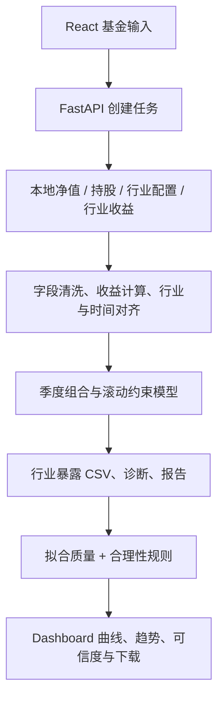

# 从研究模型到产品

## 用户与需求

目标用户为基金研究员与基金筛选、组合研究人员。核心任务是在披露空窗期识别值得复核的行业变化。

MVP 需求包括：输入基金代码、选择本地数据、看到分析进度、查看暴露和变化、理解可信度、导出研究材料。产品不承担自动交易或投资结论替代。

## 数据到交互

| 模块 | 责任 |
|---|---|
| frontend/src | React 交互、Recharts 图表、分析状态与结果页 |
| api/server.py | 本地后台任务、健康检查、下载接口与静态页面 |
| api/presentation.py | 将模型产物转换为界面数据 |
| api/credibility.py | 模型质量与结果可信度分开评定 |
| lib/simulate.py | 清洗持股，构建季度模拟行业组合 |
| lib/regress.py / solver.py | 日收益对齐与滚动时间加权非负 Lasso |
| run_analysis.py | 编排分析，写出报告和结果 |
| calibration_worker.py | 独立标定与超时隔离，候选不自动进入生产 |

后端目录沿用 api 而非改名 backend，避免为展示改动导入路径。前后端分离职责，本地生产模式由 FastAPI 提供 frontend/dist。

## 输入与结果

原模型输入为 nav.csv、holdings.csv、industry_alloc.csv、行业指数与股票行业映射。Public 仓库不包含这些研究文件。

输出包括 weekly_positions.csv、diagnostics.csv、sim_portfolio.csv、report.md、positions.png。公开仓库仅保留已获本次展示请求授权的截图与结果图，不提供整段原始数据或结果数据库。

## 设计取舍

将模型计算与结果解释分离，使 UI 能展示质量提示而不修改数学模型。快速分析与慢速标定隔离，避免未完成参数影响研究输出。只绑定本机 127.0.0.1，不提供云端账号或多租户能力。

业务价值尚需用户实验：同一研究任务下比较耗时、有效线索、误报与持续复用，不能由 R² 代替。

